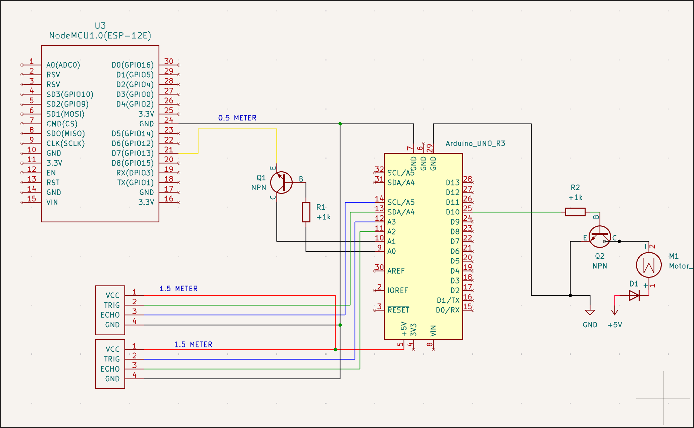

### [Click here to open my project on my site](http://nickesselman.nl/?project=discotrashbin)  
Explore the interface before diving into the build details.

# Trash Bin
Arduino sketch for a trash-bin: two ultrasonic sensors watch for people, a servo opens the lid, and an Adafruit Music Maker shield plays MP3s while an auxiliary NPN output flashes external FX.

**Setup:** Load the sketch, drop `TRIGGER.MP3` and `SEQ1-3.MP3` on the SD card, wire the sensors, servo (pin 9), and button (A0), then power the rig.

**Controls:** Walk up to trigger the lid + sound. Tap the button to toggle the NPN output, hold it to play the three-track sequence, or send an empty line over serial to test.

Adjust distances, servo limits, or timing at the top of `trashbin.ino` to fit your build.

  

  
  

<video class="journal-video" controls playsinline style="aspect-ratio: 2160/3840;" src="https://hc-cdn.hel1.your-objectstorage.com/s/v3/cc011139dd6296c27912b7d7d9b3e75693dc8d07_tmp_3Achat_3A2025-11-02_3Acmh69pxsq00cop401dxr6jvx8_3Adb80fe575ddba916"></video>
<video class="journal-video" controls playsinline style="aspect-ratio: 2160/3840;" src="https://hc-cdn.hel1.your-objectstorage.com/s/v3/378a4e8e3ee834eae5dc67edbf6bcdab10e5cb80_tmp_3Achat_3A2025-11-02_3Acmh69pxsq00cop401dxr6jvx8_3A7c3b90f674708059"></video>
